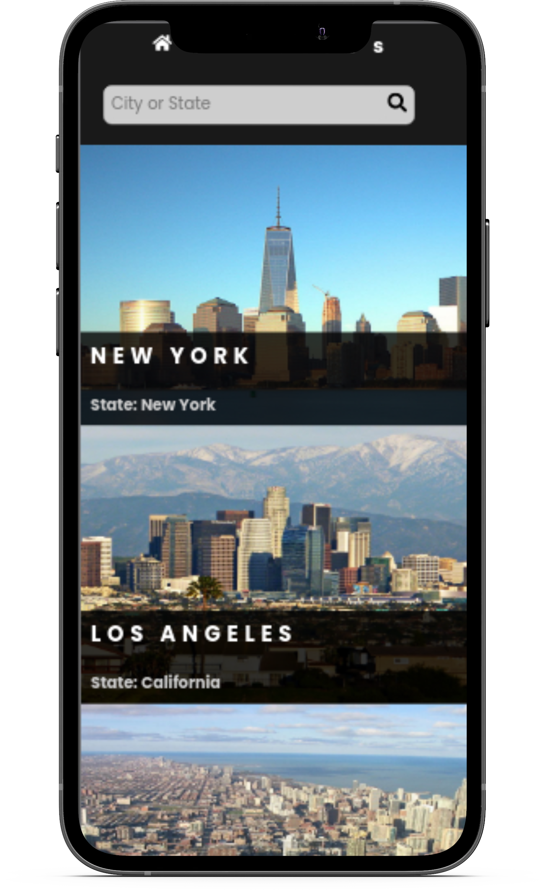

# UsCities Catalogue
  
> A simple catalogue of US Cities with React/Redux

I developed this project as the capstone project after completing Microverse's React/Redux course. It deals with a simple catalogue of the [United States](https://en.wikipedia.org/wiki/List_of_states_and_territories_of_the_United_States) using redux state management. With it: you can get a list of 1000 first United States cities that have a population over 10,0000, city's growth between 2000 and 2013, city's coordinate, and get the link to the city's details which redirects you to Wikipedia. I used SASS to style it.

_Note:_ As the project's requirements found on [this link](https://www.notion.so/microverse/Catalogue-of-Recipes-ea589778a95f47fa98034d99d4016d2b) show the design, the design focuses mainly on mobile view. So as a result this app is better viewed on screens below 768px.
## Built With

- React/Redux
- SASS

## Live Demo

[Live Demo Link](https://descholar-us-cities-catalogue.netlify.app/)

## Getting Started

To get a local copy up and running follow these simple example steps.

### Prerequisites
- [Node.js](https://nodejs.org/en/) Installed on your local computer

### Install
1. Clone this Repository by running `git clone https://github.com/descholar-ceo/us-cities-catalogue` and `cd us-cities-catalogue`
2. Run `yarn` or `npm install` :point_right: to install all needed dependencies
### Usage
Run `yarn start` or `npm start`, the development server will start and the browser windows should get opened automatically, otherwise go on your browser and type `localhost:3000`, there you go
### Run tests
Run `yarn test` to run tests
### Deployment
This app is deployed to [netlify](https://descholar-us-cities-catalogue.netlify.app/)

## Authors

👤 **Mugirase Emmanuel**

- GitHub: [@Mugirase Emmanuel](https://github.com/descholar-ceo)
- Twitter: [@Mugirase Emmanuel](https://twitter.com/descholar3)
- LinkedIn: [Mugirase Emmanuel](https://linkedin.com/in/mugirase-emmanuel)

## 🤝 Contributing

Contributions, issues, and feature requests are welcome!

Feel free to check the [issues page](https://github.com/descholar-ceo/us-cities-catalogue/issues).

## Show your support

Give it a :star: if you like this project!

## Acknowledgments

- [Microverse](https://www.microverse.org/)
- [Marc-Antoine Roy](http://mantoine.ca/) for the design idea
